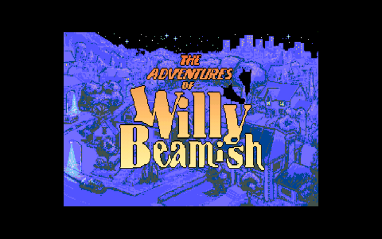
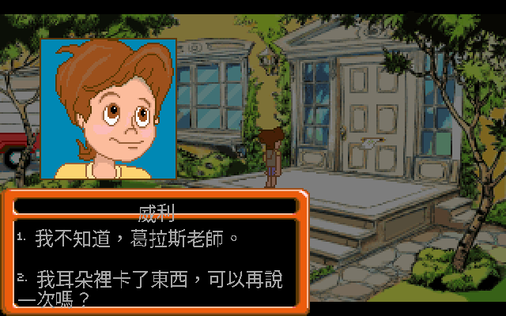
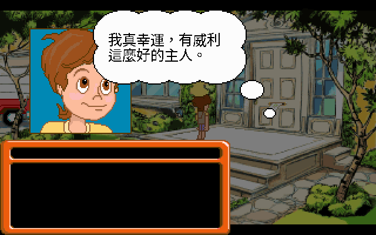
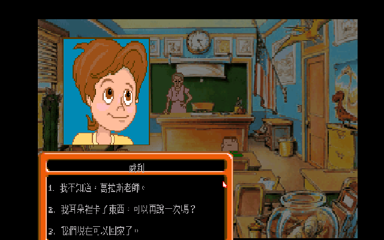
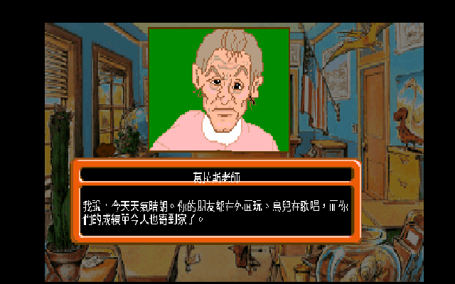
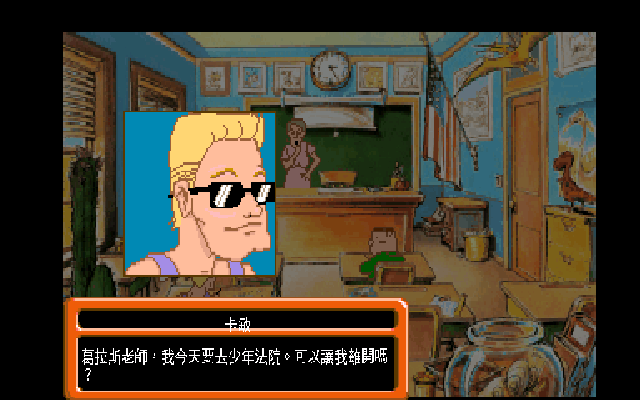
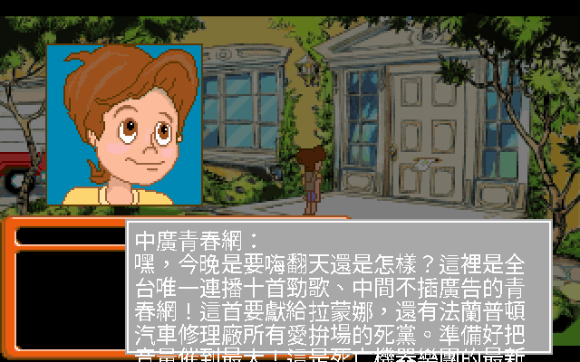
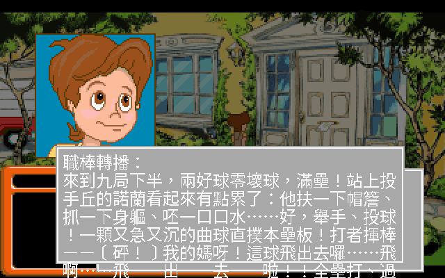
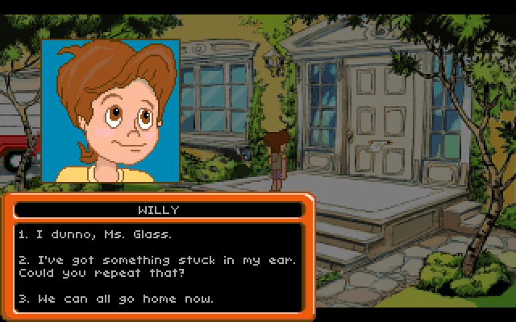

<!-- markdownlint-disable MD033 MD041 -->

# 威利奇遇記 · The Adventures of Willy Beamish 繁體中文化

> Dynamix 1992 年的 talkie CD 冒險遊戲，三十四年後的繁體中文版。
> 在 ScummVM 上遊玩，按一個鍵就能在中英文之間切換 —— 不改你的任何一個遊戲檔。

<p align="center">
  
</p>

> 標題畫面在英文金字「Willy Beamish」下方加上同款金色中文副標**「威利奇遇記」** —— 不只是 README 的圖，**遊戲執行時的標題畫面也會即時疊上**（引擎 overlay，模仿英文字體的金色漸層與描邊）。

<p align="center">
  
  
</p>

---

## 給三十年後的那個小孩 —— 一封開場信

還記得嗎？1992 年的某個暑假，你蹺著二郎腿坐在 14 吋 CRT 前，看著螢幕裡那個戴墨鏡、揹著書包、一臉「我才不在乎」的九歲小孩 —— 威利·比米許。那是個你不需要當英雄、不需要拯救世界的遊戲；你要做的，只是熬過放暑假前的最後一天、訓練你那隻寶貝青蛙霍尼去比青蛙跳大賽、然後想辦法不要被那個笑裡藏刀的保姆莉歐娜抓去做家事。

那時候沒有 GameFAQ、沒有 Discord、沒有 wiki。那是一張要 CD-ROM 播放器、要 386、要「560,000 bytes 常規記憶體」才跑得動的「多媒體」遊戲 —— 而且它**會說話**。在那個多數遊戲還只有 beep 聲的年代，威利的角色們是真的用配音講台詞的。我們這些守在 Sound Blaster 旁邊的小孩，第一次聽到遊戲裡的人「開口」 —— 也第一次聽到收音機從威利家的牆角傳出一整排台灣味十足的電台。

可惜，他們開口講的是英文。當年《電腦玩家》《軟體世界》的攻略只能把對話一句一句翻給你聽。三十四年後，這個專案做的，就是把整套對話搬回中文 —— 還給那個聽不懂、卻還是玩得很開心的小孩。

這封信你可以三層讀：想直接玩 → 跳到 [快速開始](#quick-start)；想重溫劇情與角色 → 慢慢讀 [遊戲本體](#magazine)；想知道技術上怎麼把英文「換」成中文 → 翻到 [技術深潛](#tech)。

---

## 目錄

- [快速開始](#quick-start)
- [遊戲本體 —— 一個九歲小孩的暑假](#magazine)
  - [威利與他的一家](#family)
  - [青蛙、保姆、與下水道](#plot)
  - [會說話的遊戲：talkie 的魔法](#talkie)
- [譯名考古學](#names)
- [1992，台灣的電台](#radio)
- [技術深潛 —— 英文怎麼變中文](#tech)
  - [封裝與資源：RESOURCE.MAP](#resource)
  - [對話去哪了？SDS 1.224 與 DDS 的祕密](#dds)
  - [名牌修正：別讓威利出現兩次](#nameplate)
  - [文字溢出：中文比英文高](#overflow)
  - [名牌置中：別讓「威利」沉下去](#center)
  - [文案總監的逐句潤稿](#polish)
  - [引擎 overlay 與打包](#engine)
- [致謝](#thanks)
- [版權聲明](#legal)

---

<a name="quick-start"></a>

## 🎮 快速開始

你需要一份**自己合法擁有**的 Willy Beamish 遊戲資料夾（內含 `RESOURCE.MAP` + `RESOURCE.001`）。本專案**不含、也不發布**任何遊戲原始檔。

中文化已打包成**四大平台**（中文是「疊」在原始英文遊戲上的 overlay，可隨時切回英文對照，存檔與遊戲檔完全不受影響）：

| 平台 | 產物 | 怎麼玩 |
|---|---|---|
| **Linux** | `Willy-Beamish-CHT-x86_64.AppImage`（單檔）/ `willy-cht-linux-x86_64.tar.gz` | `./Willy-Beamish-CHT-x86_64.AppImage /你的/遊戲路徑`（不給路徑會自動偵測旁邊的遊戲）|
| **Windows** | `willy-cht-windows-x86_64.zip` | 把遊戲資料夾改名 `game` 放進解壓資料夾，雙擊 `play-willy-cht.bat` |
| **macOS** | `willy-cht-macos.tar.gz`（arm64 `.app`）| `Contents/MacOS/scummvm --extrapath=Contents/Resources/extra --path=<遊戲> beamish` |
| **Android** | `willy-cht-android-FULL.apk`（含遊戲，自留）/ 或 CI base APK + 本機注入 | 直接安裝，開 app 即可玩 |

- 預設就是**中文 24×24**。遊戲中按 **F8** 循環：中文 24×24 → 中文 16×16 → 英文原版。
- 引擎來源：Linux/Windows 本機（mingw 交叉編譯）、macOS/Android 由 GitHub Actions CI（`.github/workflows/build.yml`）建置。**含遊戲的完整包僅供自己保存，請勿散布。**

---

<a name="magazine"></a>

## 🕹️ 遊戲本體 —— 一個九歲小孩的暑假

要懂這份中文化在翻什麼，得先回到威利的世界。這不是一個有龍、有槍、有反烏托邦的遊戲；它的舞台小到只有一個叫 Frumpton 的小鎮、一所卡邦可小學、一棟比米許家的房子。但正因為小，它才那麼真 —— 它演的是每個小孩都懂的事：被老師釘在黑板前、跟姊姊搶電話、怕大人發現你又闖禍了。

<a name="family"></a>

### 威利與他的一家

老玩家絕對記得那塊在對話框上方亮起的**名牌**。誰在講話，一看就知道。這次中文化把全部 **189 塊名牌**都翻了過來 —— 威利、希拉、戈登，一個都不漏。

| 英文 | 中文 | 在遊戲裡 |
|---|---|---|
| **Willy** | **威利** | 九歲主角，墨鏡、書包、一身「我最叛逆」。台詞最多（308 句）|
| **Gordon** | **戈登** | 老爸。老實的水管工，被工會老大陷害丟了飯碗 |
| **Sheila** | **希拉** | 老媽。在這個快散架的家裡努力維持秩序 |
| **Tiffany** | **蒂芬妮** | 青春期姊姊，電話一講三小時，戀愛腦全開 |
| **Brianna** | **布莉安娜** | 還在搖籃裡的小妹妹 |
| **比米許爺爺** | **比米許爺爺** | 過世的爺爺，化成鬼魂在關鍵時刻給威利出主意 |
| **Horny** | **霍尼** | 寵物青蛙，威利的命根子，要去比青蛙跳大賽 |

**最讓人會心一笑的是**：你以為威利是主角，但這個家裡最有戲的，其實是那隻不會講話的青蛙。上面那張思考泡泡截圖 —— 「我真幸運，有威利這麼好的主人」—— 就是霍尼的心聲。一隻青蛙的內心獨白，配上 1992 年的點陣頭像，這就是 Dynamix 的幽默。（這隻青蛙到底叫什麼，我們其實栽過一個跟頭 —— 詳見 [譯名考古學](#names)。）

<a name="plot"></a>

### 青蛙、保姆、與下水道

故事從一個再普通不過的災難開始：暑假前最後一天，威利在課堂上被葛拉斯老師逮個正著，成績單慘不忍睹。回到家，老爸戈登正因為水管工會老大路易·史圖爾的骯髒手段而焦頭爛額；老媽請了個保姆莉歐娜 —— 一個笑容甜到發膩、骨子裡卻打著壞主意的女人。

接下來的事，只有 1990s 的冒險遊戲敢這樣寫：威利得鑽進**下水道**、跟住在裡面的怪物「下水道怪」打交道、闖進工會的污泥廠、還要帶著寵物青蛙霍尼去拼 Tootsweet 青蛙跳大賽。一個九歲小孩的暑假，被 Dynamix 寫成了一齣黑色幽默的都市冒險。

這份中文化把這 **2,105 句對話**全部翻了過來，語氣盡量保留原作那種**俏皮帶吐槽**的童趣 —— 威利嘴硬、蒂芬妮三八、戈登無奈、莉歐娜假掰，每個人講話都該有自己的調調。

<a name="talkie"></a>

### 會說話的遊戲：talkie 的魔法

這是 Willy Beamish 的 **CD「多媒體」版**，也就是當年最高規格的 talkie。**老玩家最有印象的**，就是角色講話時那顆會動的大頭像，配上真人配音 —— 在 1992 年，這簡直是黑科技。

中文化保留了這份魔法：配音還是英文（我們沒有重配），但**字幕全部中文**。遊戲內按 `Alt+B` 可以開關字幕、`Alt+T` 開關語音 —— 你可以一邊聽英文配音、一邊讀中文字幕，像看一齣有字幕的卡通。技術上，這也帶來一個有趣的考古發現，留到[技術深潛](#talkie-tech)再說。

下面是**實機 gameplay**（真滑鼠驅動，非擺拍）：暑假前最後一天的教室裡，威利、葛拉斯老師、同學卡敏輪流講話 —— 每個人的會說話頭像配上自己的中文名牌與字幕：

<p align="center">
  
  
  
</p>

> 16×16 字級下三個對話選項剛好全部塞進對話框；24×24 字級更大更清楚，適合單句對白。按 F8 即時切換。

---

<a name="names"></a>

## 📖 譯名考古學

老遊戲漢化最難的，從來不是「翻得對」，而是「翻得像」。這次的方針很明確：**主角忠實、配角玩梗**。

威利就是威利 —— 一個九歲小孩的名字，不需要花俏。但配角們就是另一回事了。Dynamix 在這款遊戲裡塞滿了 1990s 的流行文化戲仿，譯者的工作就像考古：

- **任天哩（Nintari）** —— 一看就知道在戲仿任天堂。威利沉迷的那台掌機，是對當年電玩文化的調侃。
- **星艦迷航記梗** —— 對話裡藏著「光子魚雷」「曲速十」「We're dead, Jim」。1990s 的孩子看《銀河飛龍》長大，這些梗一翻出來就懂。
- **品牌諧仿** —— 「Calvin Inclined」戲仿 Calvin Klein、「Needless Markup」戲仿 Neiman Marcus。這些當年大人才看得懂的諷刺，我們盡量用中文保住那層壞笑。
- **廣播電台呼號** —— KNTY、KMED、KROK、KBAT、KGOD…一整排對美國電台命名規則的惡搞（這一段我們玩很大，詳見 [1992，台灣的電台](#radio)）。

我們不去「糾正」原作，只是**還原它在玩什麼梗**，再用 1990s 台灣孩子聽得懂的方式講一次。

### 那隻青蛙不叫史帕奇 —— 軟體世界給我們的一記耳光

但考古最怕的，是**靠記憶辦案**。我們一開始信誓旦旦地說：威利的寵物青蛙叫「史帕奇（Sparky）」—— 多自然的名字啊，一隻活蹦亂跳的小青蛙，叫史帕奇剛剛好。譯名表都填好了，名牌也排上去了。

直到我們翻出兩本舊雜誌。

這次我們找到了 **《軟體世界》第 34、35 期**的《威利奇遇記》完全攻略，作者「阿寬」 —— 那是 1992 年、在還沒有 GameFAQ 的年代，台灣孩子唯一能靠的破關聖經。我們把它一頁一頁轉寫成 [`docs/攻略/軟體世界-威利奇遇記-完全攻略.md`](docs/攻略/軟體世界-威利奇遇記-完全攻略.md)，當作這次中文化的**考證 oracle**。轉寫到一半，糗大了 —— 攻略裡那隻青蛙，從頭到尾都叫 **霍尼（Horny）**。回頭一查遊戲原始字串（`dialogs_en.json`），這名字出現了整整 40 次，**Sparky 一次都沒有**。

我們憑記憶犯的錯，被一本三十四年前的雜誌、加上遊戲自己的字串，當場抓包。那隻青蛙不叫史帕奇 —— 牠叫**霍尼**，從來都是。

阿寬那兩本攻略還順手幫我們釘死了好幾個譯名：標題就叫**《威利奇遇記》**（不是我們瞎猜的別的）、青蛙跳賽事當年雜誌譯「**凱旋大賽**」、母青蛙叫**姬姬（Gigi）**、紀錄保持者的對手蛙是**渦輪蛙（Turbofrog）**。這些都是 1992 年阿寬坐在 14 吋螢幕前、一格一格玩出來、再一字一字寫進雜誌的東西 —— 我們只是三十四年後，把它接回中文版裡。

當然，**人名拼字最後還是以遊戲字串為準**：阿寬那年代是人工聽打 + 人工翻譯，攻略裡也有手民之誤（城鎮 Frumpton 被寫成 Frumford、掌機 Nintari 印成 NINTAW）。雜誌負責還原**時代用語**，遊戲字串負責**校準拼字** —— 兩邊互相對帳，才是真正的考古。完整譯名表見 [`CONTEXT.md`](CONTEXT.md)，向阿寬與《軟體世界》編輯部致敬。

---

<a name="radio"></a>

## 📻 1992，台灣的電台

譯名考古講的是「把美國梗翻成中文」。但這款遊戲裡藏著一個地方，讓我們忍不住**跨過翻譯、直接重寫** —— 那就是威利家牆角那台收音機。

老玩家可能不記得了：威利在家裡可以「轉電台」。原作做了六個美式廣播戲仿 —— 搖滾連播的 KROK、醫療 call-in 的 KMED、政論名嘴 KTOK（一個叫 Lush Limberger 的醉漢，明擺著戲仿 Rush Limbaugh）、棒球轉播 KBAT、火與硫磺佈道的 KGOD、唱衰自己的鄉村歌台 KNTY。這六個台，每一個都是美國孩子一聽就笑、台灣孩子一臉問號的東西。

直翻，是糟蹋。我們做了一個大膽的決定：**把這六個美國電台，整組換成 1992 年台灣人真正在收聽的那個收音機世界**。不是翻譯，是重建一台台灣的收音機。

| 原作美國台 | 戲仿什麼 | 我們換成的台灣台 |
|---|---|---|
| **KROK** | 搖滾連播 | **中廣青春網** —— 那個 1988 到 1994 的青春流行台，「全台唯一連播十首勁歌、中間不插廣告」 |
| **KMED** | 醫療 call-in | **地下電台賣藥** —— 台語親民的「順仔藥師健康現場」，最道地的 1990s 台灣聲音 |
| **KTOK** | 政論名嘴 | **地下電台政論** —— 醉醺醺的 Lush Limberger 在地化成「凍蒜伯開講」 |
| **KBAT** | 棒球轉播 | **中華職棒轉播** —— 1992 正是兄弟象、統一獅的職棒狂熱，「全壘打、過牆啦！」 |
| **KGOD** | 火與硫磺佈道 | **佈道電台** —— 火爆的勸世講道 |
| **KNTY** | 搞笑鄉村歌 | **台語金曲電台** —— 悲情台語芭樂歌《阮乎人催眠去，只因阮翁肝硬化》 |

閉上眼睛想一想 1992 年的那台收音機：旋鈕一轉，先是中廣青春網連著放十首勁歌，主持人喊著「嗨翻天」；再轉一格，地下電台的順仔藥師用台語跟阿桑搏感情賣藥；再一格，凍蒜伯灌了幾杯黃湯開始開講；再一格，職棒轉播裡諾蘭站上投手丘，「九局下半、兩好球零壞球、滿壘」；再轉，是火爆佈道、是肝硬化的悲情台語歌。那不是美國的廣播 —— 那是你家客廳、你阿公的計程車、夜市攤子上那台收音機真正流出來的聲音。

<p align="center">
  
  
</p>

我們在台味上拿捏得很小心：台語詞只是點綴（順仔、凍蒜、阿桑、過牆啦），不會通篇台語讓人讀不下去 —— 就像 1992 年那台收音機，國台語本來就是混著走的。這六個台不影響破關、不影響一句劇情，它純粹是個彩蛋。但我們相信，**任何一個在 1992 年轉過收音機的台灣小孩，轉到威利家那台收音機的時候，會愣一下，然後笑出來**。這一格，是整個中文化裡我們最捨不得的一段鄉愁。

---

<a name="tech"></a>

## 🔧 技術深潛 —— 英文怎麼變中文

以下是工程紀錄。本中文化走 **engine-side overlay** 路線：不動遊戲資料，改 ScummVM 在繪字的地方攔截、查表、用點陣中文字型重畫到高解析疊圖層。三個產物：翻譯包 `zh.dtr`、點陣字 `beamish_zh{16,24}.dcjk`、引擎 patch `patches/dgds-cjk.patch`。

<a name="resource"></a>

### 封裝與資源：RESOURCE.MAP

Willy Beamish 的遊戲資料封在 `RESOURCE.MAP`（索引）+ `RESOURCE.001`（151 MB 資料）裡，是 DGDS 引擎的 **MAP 變體**（姊妹作 Rise of the Dragon 用的是 `VOLUME.VGA`）。

`tools/dgds_volume.py` 鏡射 ScummVM `resource.cpp` 的索引格式，一次抽出 **3,402 個資源**：

```text
sds=74  dds=68  ttm=109  ads=73  cds=2158  tds=62
bmp=464 scr=150 pal=144  fnt=6   ...
```

```bash
python3 tools/dgds_volume.py game --extract extracted/
```

<a name="dds"></a>

### 對話去哪了？SDS 1.224 與 DDS 的祕密

這是整個專案**最關鍵的考古發現**。

在 Rise of the Dragon（SDS 場景版本 `" 1.211"`），對話是**直接內嵌在每個場景檔 `.sds`** 裡的。我們本以為 Willy 也一樣 —— 結果 `extract_dialogs.py` 一跑就全軍覆沒：

```text
FAIL s10.sds: unexpected ver ' 1.224'
```

Willy 的 SDS 版本是 **`" 1.224"`**。翻開 ScummVM `scene.cpp`，真相大白：

```cpp
// SDSScene::parse(), scene.cpp:573
if (isVersionUnder(" 1.214")) {
    readDialogList(stream, _dialogs);   // 1.224 不符合此條件 → 不執行！
}
```

**版本 1.224 的場景檔根本不含對話。** 那對話在哪？答案是 **68 個 `D<N>.DDS` 檔**（Dialog Data Set）—— 遊戲在需要時才透過 scene op 動態載入：

```cpp
// SDSScene::loadDialogData(), scene.cpp:681
const Common::String filename = Common::String::format("D%d.DDS", fileNum);
...
result = readDialogList(stream, _dialogs, fileNum);   // 用同一個 readDialogList，但 fileNum != 0
```

於是 `tools/extract_dialogs.py` 改寫成讀 DDS、用**動態版本述詞**（從檔案自己的版本字串算 `isVersionOver`/`isVersionUnder`）解析 1.224 欄位佈局，並以 `<DDS檔號>:<num>` 為鍵：

```bash
python3 tools/extract_dialogs.py extracted/ dialogs_en.json
# 68 DDS files, 2105 dialogs, 0 parse failures, versions=[' 1.224']
```

<a name="talkie-tech"></a>

那另外那 **2,158 個 `.cds` 和 62 個 `.tds`** 呢？它們是 talkie 版的**會話頭像動畫 + 語音同步腳本**（檔名 `F<n>B<n>.CDS`），**完全不含可翻譯的文字** —— 字幕文字其實一直都在 DDS 的 `_str` 欄位裡。換句話說，**翻 DDS 就等於翻了全部對白字幕**，不需要另外做字幕系統。一個漂亮的巧合。

<a name="nameplate"></a>

### 名牌修正：別讓威利出現兩次

第一次跑起來時，畫面是這樣的：對話框上方的名牌寫著英文 **WILLY**，下面的內文卻是中文「威利：1. 我不知道…」。名字出現兩次，而且一中一英。

翻開引擎才懂：type-2（`kDlgFrameBorder`）對話框會把 `_str` 裡**冒號緊接換行**的部分（`WILLY:\r`）切成獨立名牌、只把後面的內文交給內文繪製函式。原版英文因此名牌是 `WILLY`、內文是乾淨的選項，不重複。

我們的譯文卻是完整的 `威利：\r1. 我不知道…`，於是內文重新出現了名字。修法兩刀：

1. **引擎**：在 CJK 繪字路徑鏡射 `drawType2` 的切分邏輯，把譯文開頭的「名字：\r」前綴剝掉（Big5-aware，認得全形「：」= `0xA1 0x47`）。
2. **資料**：`tools/gen_ui_names.py` 從 en/zh 平行資料自動生成 **182 個 `UI:<英文名> → <中文名>`** 名牌條目，名牌走 `lookupUI` 變中文，且與內文裡的譯名完全一致。

修正後，名牌是「威利」、內文是乾淨的「1. 我不知道，葛拉斯老師。」—— 跟英文原版的版面結構分毫不差。

<p align="center">
  
  
</p>

<a name="overflow"></a>

### 文字溢出：中文比英文高

24×24 的中文字比原英文字型高。三行以上的對話，譯文一旦折到第三、第四行，文字就會穿出對話框下緣、壓在背景上。

修法是在對話框繪製前，先用 `wrapText` 量出譯文實際會折成幾行，再把 `_rect.height` 往下長到剛好容納那麼多行；增高量 clamp 在螢幕底（`200 - _rect.y - 1`），避免框長到畫面外。配合把選項清單裡的雙換行 `\r\r` 折成單換行 `\r`，省下行距。現在三選項對話可以完整進框。

<a name="center"></a>

### 名牌置中：別讓「威利」沉下去

名牌字原本用 `htop + 2` 定位 —— 那是為英文字型的 baseline 調的偏移量。換成 CJK 後，「威利」這種方塊字會被往下沉、下緣壓進對話框邊界。

改成在牌框內垂直置中：`htop + (hheight - fontHeight) / 2`。名牌字回到牌框正中央，不再壓線。

<a name="polish"></a>

### 文案總監的逐句潤稿

最後一關不是工程，是文字。2,105 句對白經逐句校潤，不只是順稿 —— 過程中抓出好幾個**真正的錯譯**：

- 反向錯譯：「給我站在那裡」其實是「給我**馬上回來**」（意思整個翻反）。
- 「武士為任何人讓路」應是「戰士**絕不**讓路」（漏了否定）。
- 比賽項目「跳高」其實是「**跳遠**」（青蛙跳遠大賽，攻略也佐證）。
- 一句把 deity 誤譯成「媽祖」的台詞，潤成不帶宗教指涉的「您老母端上桌」。
- 空氣清淨機的「正離子」應為「**負離子**」。

校潤同時統一了全劇本譯名（霍尼、姬姬、渦輪蛙一致到底），並把語氣往 1990s 兒童喜劇的方向收 —— 威利嘴硬、蒂芬妮三八、戈登無奈，每個人講話都有自己的調調。

<a name="engine"></a>

### 引擎 overlay 與打包

CJK 基礎設施沿用 Rise of the Dragon 的 `dgds-cjk.patch`，套到 ScummVM master 後做兩處 Willy 專屬調整：

- `cjk.cpp`：字型檔名依 game id 泛化 —— `GID_WILLY` → `beamish_zh{16,24}.dcjk`。
- `dialog.cpp`：對話查表鍵從 scene 號改為 `_fileNum`（DDS 檔號），對齊 Willy 的對話模型。

字型用 freetype 把 Noto Sans CJK 點陣化成 Big5 linear-index 的 `.dcjk`，翻譯包是 Big5 的 `DTRN` 二進位：

```bash
python3 tools/build_cjk_font.py  --size 24 --out build/beamish_zh24.dcjk
python3 tools/build_translation.py translations/zh.json build/zh.dtr --lang 1
scripts/package_linux.sh && scripts/package_appimage.sh
```

QA 用引擎內建的 autopilot（讀 `autopilot.txt` 自我驅動跳場景、叫對話、截圖），在 headless Xvfb 下逐一驗證每個對話框的中文渲染。

**統計**：對話 2,105 句（100% 覆蓋、逐句潤稿）、名牌與 UI 共 189 條、6 個廣播電台全套在地化、翻譯包 `zh.dtr` 約 142 KB、點陣字型兩種尺寸、Big5 編碼零失敗；另以《軟體世界》第 34、35 期攻略逐頁轉寫作為 1990s 譯名 oracle。

---

<a name="thanks"></a>

## 🙏 致謝

- **Dynamix / Sierra**（1992）—— 做出這個讓無數小孩笑著長大的遊戲。
- **ScummVM 團隊**與 `dgds` 引擎的作者們 —— 沒有他們把這個冷門引擎逆向出來，這一切都不可能。
- **Rise of the Dragon 繁中化專案** —— 本專案的 engine-side overlay 路線、CJK patch、工具鏈全部站在它的肩膀上。
- 1990s 的**《電腦玩家》《軟體世界》《PC Game》**三大誌 —— 在沒有網路的年代，是你們把這些遊戲翻給我們聽。
- **《軟體世界》第 34、35 期**完全攻略的作者**阿寬** —— 三十四年前你一格一格玩出來、一字一字寫下的破關筆記，成了這次中文化最可靠的譯名 oracle（是你讓我們知道那隻青蛙叫霍尼，不叫史帕奇）。

---

<a name="legal"></a>

## ⚖️ 版權聲明

本專案是**衍生性中文化工作**，只包含：翻譯資料、點陣字型、引擎 patch、提取/打包工具。

**不含、也永不發布**任何遊戲原始檔、磁碟映像、或受版權保護的素材。The Adventures of Willy Beamish 的版權屬 Dynamix / Sierra 之權利繼承者所有。你必須自備一份合法擁有的遊戲。完整打包版（含遊戲）僅供自己保存，**請勿散布**。
